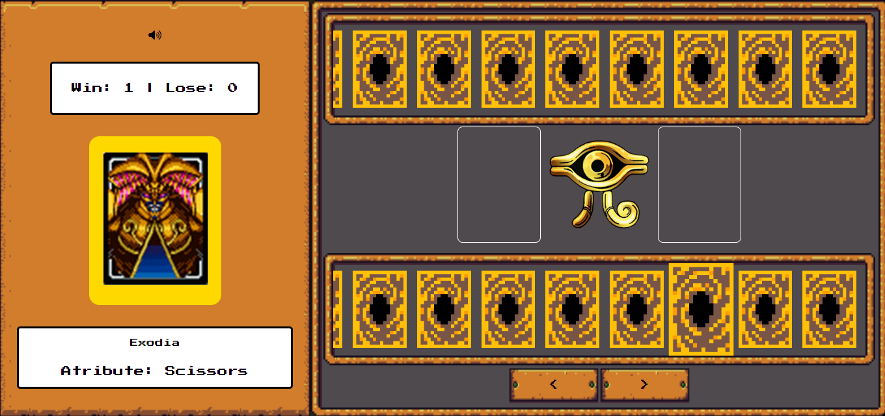

# Yu-Gi-Oh | Jo-ken-po Edition

Jogo de jokenpo desenvolvido no Bootcamp Programação de Jogos da DIO.

Escolha uma carta e a sorte será lançada.

## Conceitos abordados:

- Armazenamento e gerenciamento de estado manual
- Funções limpas
- Organização de código

## Para jogar

Acesse o site [aqui](https://arianecledja.github.io/js-yugioh-game/)

## Créditos

[Projeto base](https://github.com/digitalinnovationone/js-yugioh-assets)